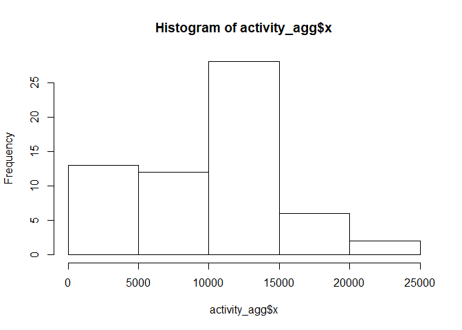
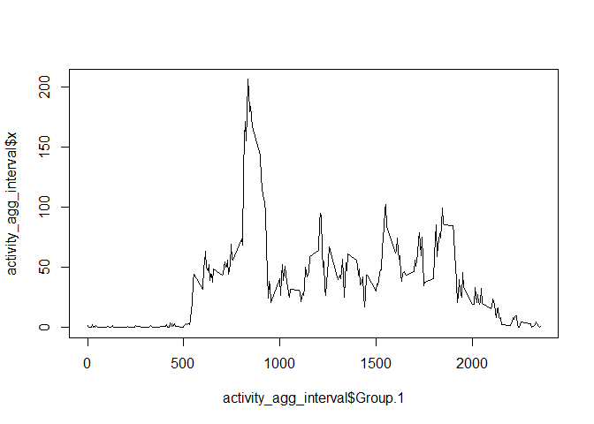
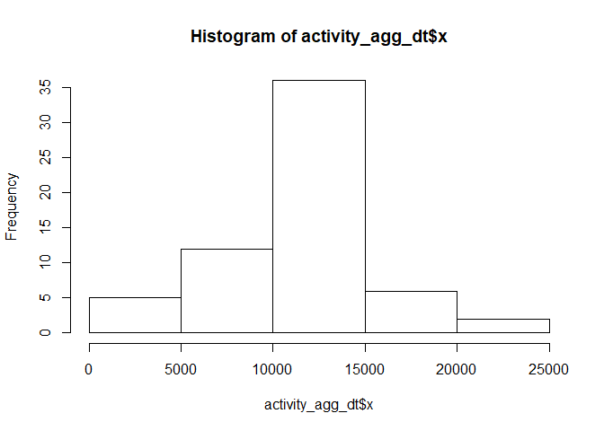
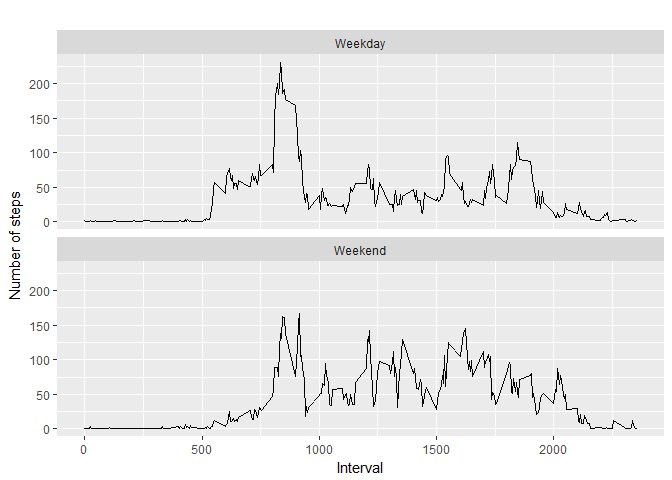

Loading and preprocessing the data
----------------------------------

Load the data Process/transform the data (if necessary) into a format
suitable for your analysis

    ## loading the file
    activity<-read.csv(file="activity.csv")
    ## transforming data
    activity$date<-as.Date(activity$date)
    summary(activity)

    ##      steps             date               interval     
    ##  Min.   :  0.00   Min.   :2012-10-01   Min.   :   0.0  
    ##  1st Qu.:  0.00   1st Qu.:2012-10-16   1st Qu.: 588.8  
    ##  Median :  0.00   Median :2012-10-31   Median :1177.5  
    ##  Mean   : 37.38   Mean   :2012-10-31   Mean   :1177.5  
    ##  3rd Qu.: 12.00   3rd Qu.:2012-11-15   3rd Qu.:1766.2  
    ##  Max.   :806.00   Max.   :2012-11-30   Max.   :2355.0  
    ##  NA's   :2304

What is mean total number of steps taken per day?
-------------------------------------------------

For this part of the assignment, you can ignore the missing values in
the dataset.

1- Calculate the total number of steps taken per day

    activity_agg<- aggregate(activity$steps, by=list(activity$date), FUN=sum, na.rm=TRUE )
    head(activity_agg)

    ##      Group.1     x
    ## 1 2012-10-01     0
    ## 2 2012-10-02   126
    ## 3 2012-10-03 11352
    ## 4 2012-10-04 12116
    ## 5 2012-10-05 13294
    ## 6 2012-10-06 15420

2- If you do not understand the difference between a histogram and a
barplot, research the difference between them. Make a histogram of the
total number of steps taken each day

    hist(activity_agg$x)

3- Calculate and report the mean and median of the total number of steps
taken per day

    mean(activity_agg$x)

    ## [1] 9354.23

    median(activity_agg$x)

    ## [1] 10395

What is the average daily activity pattern?
-------------------------------------------

1- Make a time series plot (i.e. type = "l") of the 5-minute interval
(x-axis) and the average number of steps taken, averaged across all days
(y-axis)

    activity_agg_interval<- aggregate(activity$steps, by=list(activity$interval), FUN=mean, na.rm=TRUE )
    plot(activity_agg_interval$Group.1,activity_agg_interval$x, type ='l', nx='1')

    ## Warning in plot.window(...): "nx" is not a graphical parameter

    ## Warning in plot.xy(xy, type, ...): "nx" is not a graphical parameter

    ## Warning in axis(side = side, at = at, labels = labels, ...): "nx" is not a
    ## graphical parameter

    ## Warning in axis(side = side, at = at, labels = labels, ...): "nx" is not a
    ## graphical parameter

    ## Warning in box(...): "nx" is not a graphical parameter

    ## Warning in title(...): "nx" is not a graphical parameter

2- Which 5-minute interval, on average across all the days in the
dataset, contains the maximum number of steps?

    activity_agg_interval[which.max(activity_agg_interval$x),]

    ##     Group.1        x
    ## 104     835 206.1698

Imputing missing values
-----------------------

1- Calculate and report the total number of missing values in the
dataset (i.e. the total number of rows with NAs)

    sum(is.na(activity$steps))

    ## [1] 2304

2-Devise a strategy for filling in all of the missing values in the
dataset. The strategy does not need to be sophisticated. For example,
you could use the mean/median for that day, or the mean for that
5-minute interval, etc.

Strategy: we will replace the missing values with the mean of the
interval for that day

3- Create a new dataset that is equal to the original dataset but with
the missing data filled in.

    ActivityComplete <- activity  
    for (i in 1:nrow(ActivityComplete)) {
      if (is.na(ActivityComplete[i, 1])) {
        
        ActivityComplete[i,1 ]<- activity_agg_interval[activity_agg_interval$Group.1==ActivityComplete$interval[i],2]
          
        
      }
    }

4-Make a histogram of the total number of steps taken each day and
Calculate and report the mean and median total number of steps taken per
day. Do these values differ from the estimates from the first part of
the assignment? What is the impact of imputing missing data on the
estimates of the total daily number of steps?

    ## 4.a. taking aggregate day by day

    activity_agg_dt<- aggregate(ActivityComplete$steps, by=list(ActivityComplete$date), FUN=sum, na.rm=TRUE )

    ## 4.b. Make a histogram of the total number of steps taken each day (Imputed)
    hist(activity_agg_dt$x)

    ## 4.c. Calculating mean()
    mean(activity_agg_dt$x)

    ## [1] 10766.19

    ## 4.d. Calculating median()
    median(activity_agg_dt$x)

    ## [1] 10766.19

    ## 4.e. Yes the mean and median have changed.

Yes the mean and median have changed.

Are there differences in activity patterns between weekdays and weekends?
-------------------------------------------------------------------------

Create a new factor variable in the dataset with two levels - "weekday"
and "weekend" indicating whether a given date is a weekday or weekend
day.

    ActivityComplete$day <- weekdays(ActivityComplete$date)
    ActivityComplete$day<- ifelse(ActivityComplete$day == "Saturday" | ActivityComplete$day == 
                                    "Sunday", "Weekend", "Weekday")
    ActivityComplete$day <- factor(ActivityComplete$day)

    head(ActivityComplete)

    ##       steps       date interval     day
    ## 1 1.7169811 2012-10-01        0 Weekday
    ## 2 0.3396226 2012-10-01        5 Weekday
    ## 3 0.1320755 2012-10-01       10 Weekday
    ## 4 0.1509434 2012-10-01       15 Weekday
    ## 5 0.0754717 2012-10-01       20 Weekday
    ## 6 2.0943396 2012-10-01       25 Weekday

Make a panel plot containing a time series plot of the 5-minute interval
(x-axis) and the average number of steps taken, averaged across all
weekday days or weekend days (y-axis). See the README file in the GitHub
repository to see an example of what this plot should look like using
simulated data.

    ActivityComplete_factor <- aggregate(steps ~ interval + day, ActivityComplete, mean)

    library(ggplot2)

    ## Warning: package 'ggplot2' was built under R version 3.3.3

    qplot(interval,steps,data = ActivityComplete_factor, type = 'l',  geom=c("line"),xlab = "Interval", 
          ylab = "Number of steps", main = "") + facet_wrap(~ day, ncol = 1)

    ## Warning: Ignoring unknown parameters: type

